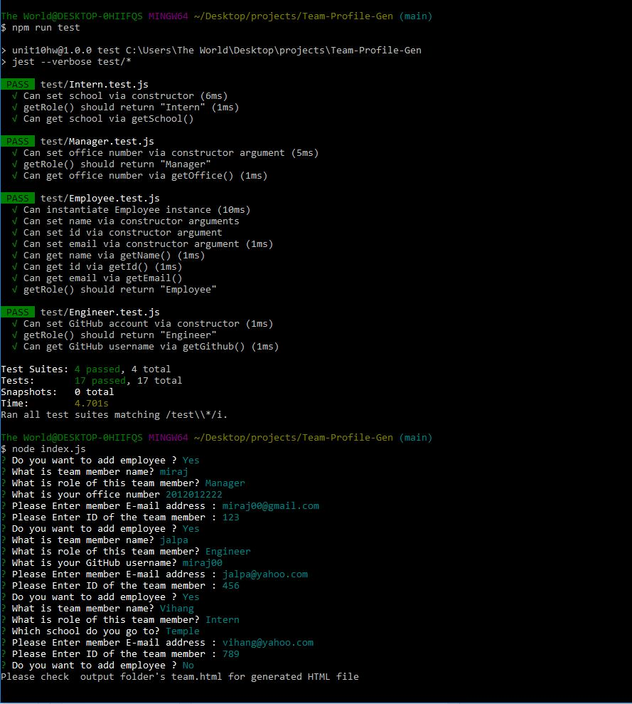

# Team-Profile-Gen

Client requested to build Team-Profile-Generator application that runs on command line and give html file as an output. 

* Minimum requirements to create this project is as follow  : 

1. Generate a webpage that displays team's basic info
1. Command line application should accept user input for team member inforamtion
1. It should prompt for member's name, role, ID, email address, Office number (if Manager), Github Username (if Engineer) and school name (if Intern) 
1. Generated HTML should display formatted team roaster
1. When clicked on Email address in HTML, it opens and populates the TO field in default email program
1. When click on gihub username, it opens a new tab and takes to github profile

Note : The instructor provided initial code to start with.

Below is the information on outcome of the project.

## Description :
Team-Profile_gen is node.js based object-oriented-programming (OOP).It works by asking questions on command prompt about team mebers and then creates HTML in output folder

## Languages and other components used : 
   * Node.js 
   * FS (File systems) 
   * npm (node package manager) 
   * inquirer package
   * Jest 

## How to install : 
 
 To install the application in your computer follow the steps below: 
 
 1. Clone the repository in your computer :
    - open the command line and go to the directory where you want to clone the repository.
    - then clone the repo by typing : " git clone git@github.com:miraj00/Team-Profile-Gen.git "

 2. Install node.js on your computer by going to https://nodejs.org/en/  
 
 3. Once node.js is installed, type "npm init" on the cammand line Terminal at root directory.
    - This will initiate npm packages

 4. Install inquirer package by typing : "npm install inquirer" on the command line
    - you don't have to answer all the question and can skip by pressing enter till end.

 5. Install Jest by typing " npm install jest --save-dev " in command line.    
 
 6. Once above steps are done, the application is ready to use.

## How to use application : 
You can use this application to generate Team Profile in HTML file. Once you follow the installation process as described above,
 
 1. You can verify if test passes by typing : " npm run test " in command line

 2. You can start Questionairrie by going to command line and enter ' node index.js '.
 
 3. This will go thru questionairie about team member name, Role, ID, Email, and Office number (if Manager), Github Username (if Engineer) and school name (if Intern). You will be allowed to input multiple entries for employees. 
 4. Upon finishing that questionairie it will generate " team.html " in " output folder ".
  

## Demo of how to install, answer Questionairre and Use the output of HTML file :

https://user-images.githubusercontent.com/84084583/130688928-3b4f4bcb-c0ae-46bc-b9a2-84f21516067f.mp4

## Screenshot of the Project :

#### Screenshot of command-line Questionairies :

 

#### Screenshot of HTML file deployed after answering questions :

 

  
## Link of Github Repository : [ Click here for GITHUB Link ](https://github.com/miraj00/Team-Profile-Gen)  
  

  
  
